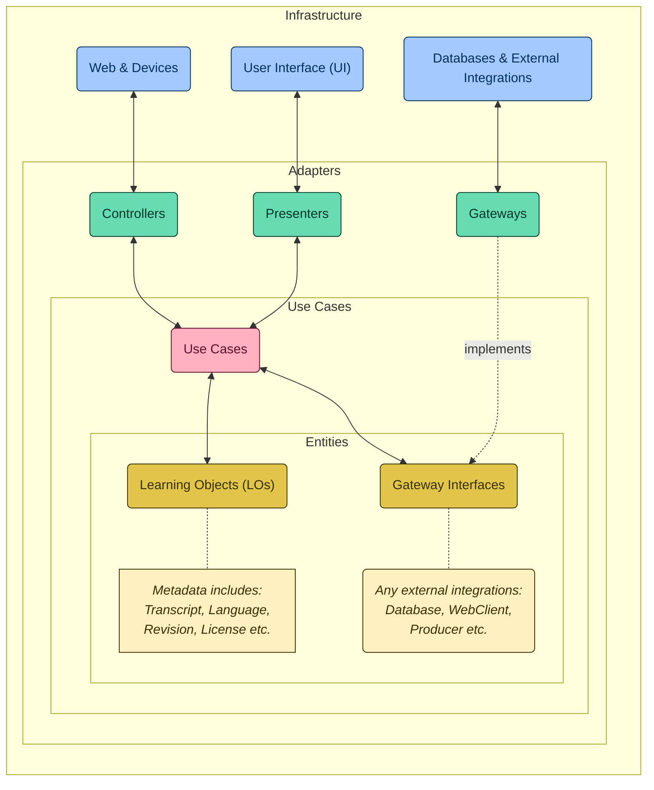

# Coding The Future #14

## Criando um App com Acessibilidade em Libras com Machine Learning e Java

Descubra como combinar os conceitos de Clean Architecture e Speech-To-Text (STT) para promover a acessibilidade de conteúdos educacionais audível. Tudo isso explorando o poder de Java 21, Spring Boot 3 e MongoDB na construção de uma API RESTful focada na transcrição precisa de áudio. Além disso, vamos criar um App Web Responsivo seguindo os conceitos de Mobile First para ser a interface da nossa solução!

Slides da apresentação disponíveis aqui: [Aceleração DIO: Acessibilidade em APIs RESTful Limpas](https://bit.ly/DIO-11-25)

## Visão Geral Prática

Tecnicamente este projeto é um sistema avançado projetado para transcrever conteúdo de áudio em formato de texto, aproveitando o poder da API da OpenAI para transcrições de alta qualidade. Nossa API REST segue os princípios da Clean Architecture para garantir uma base de código escalável, sustentável e bem organizada.

## Estrutura do Projeto e Referências

A arquitetura deste projeto é inspirada e referencia várias fontes-chave em Arquitetura Limpa e design de software. A estrutura é visualizada usando um gráfico de sereia para clareza.

### Key References and Inspirations:

- **[Speech2Learning](https://github.com/falvojr/speech2learning)**: Projeto de doutorado de [@falvojr](https://github.com/falvojr), que explora serviços de speech-to-text para melhorar a acessibilidade de objetos de aprendizagem.
- **[The Clean Architecture Blog Post](https://blog.cleancoder.com/uncle-bob/2012/08/13/the-clean-architecture.html)**: Postagem original de Robert C. Martin (Uncle Bob) sobre os princípios da Arquitetura Limpa.
- **[Clean Architecture for Spring Application](https://github.com/LuanPSantos/Clean-Architecture-For-Spring-Application)**: Um guia abrangente de [@LuanPSantos](https://github.com/LuanPSantos) sobre implementação de Arquitetura Limpa em aplicações Spring.

## Demandas de Desenvolvimento (TODOs)
Nossa equipe de desenvolvimento delineou várias TODOs principais para implementação e integração futuras:

